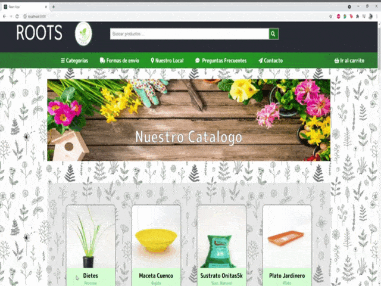

# ROOTS /E-Commerse Proyect/

Platform designed for the sale of botanical items.

## Description

It allows browsing through a list of products, selecting those that user like and generating a purchase order by prior registration of the buyer's data.

## Features

- Connection with the Firebase Database service created to host the catalog that is displayed on the website.
- Allows navigation of the catalog, its different categories and a detailed view of each article that compose it.
- Through the search engine it is possible to find products by filtering by words contained in the name, category or type of product.
- Enables the user to make a selection of items of interest and specify a number of items to buy.
- Implements a personal data form for user registration. Establishes validation mechanisms for the required data.
- From the cart view, it allows modifying the selection made in the first instance of products, immediately updating the partial values ​​of the items and the total of the purchase.
- Once the registration data has been validated, it enables the option to generate the voucher order with the selected items. Each order is forwarded to the Firebase Databes database.
- Finally, the App returns a certificate or identifier of the generated order to the user.

### `Techs`

 - React Js
 - FireBase Database/ Storage
 - Node Js

### `Usage`

- Clonar el repositorio.
- Asegurarse de tener instalado Node Js versión v14.16.0 o superior. 
- Desde el directorio interno a Root-py donde se encuentra el archivo package.json abrir la consola y ejecutar los siguientes comandos:

    - npm install
    (instala todos los módulos/dependencias utilizadas en el proyecto - el proceso puede demorar unos minutos)
    - npm start
    (abrirá automáticamente el proyecto en el puerto    [http://localhost:3000](http://localhost:3000))

### `A brief comment`
- The project did not have the participation of UI / UX, so that all the styles and animations implemented were an own desition. They were developed with native Css. Only the [FontAwsomep for React] library was implemented (https://fontawesome.com/v5.15/how-to-use/on-the-web/using-with/react).
- The Apy Key to access the Firestore database must be requested through a private channel at fdipietro01@gmail.com

### `Take a look`

             

